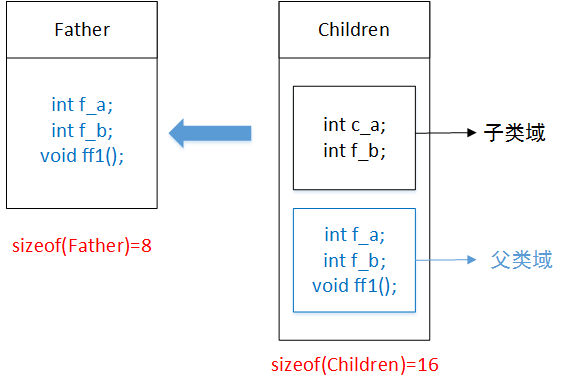

title: C++基本知识
date: 2017-05-23 14:46:04
tags:
- c++
categories: 学习
---
C++是C语言的继承,它既可以进行C语言的过程化程序设计,又可以进行以抽象数据类型为特点的基于对象的程序设计,还可以进行以继承和多态为特点的面向对象的程序设计。
C++是一门面向对象的语言,其中有许多概念容易混淆,并且在笔试和面试的过程中也有较多的涉及。下面整理了一些C++的基本知识,以供参考。
<!--more-->

## 1. sizeof()和strlen()

* sizeof()是运算符,在头文件中typedef为unsigned int,其值在编译的时候即计算好了,参数可以是数组、指针、类型、对象、函数等,不能返回动态分配的内存空间的大小。

|参数    | 说明 |
|:-------|:-----|
|数组|编译时分配的数组空间大小|
|指针|存储该指针所用的空间大小|
|类型|该类型所占的空间大小|
|对象|对象的时间占用空间大小|
|函数|函数的返回类型所占空间大小,函数的返回类型不能为void|

* strlen()是函数,要在运行时才能计算,参数必须是字符型指针。该函数的功能是从代表该字符串的第一个地址开始遍历,直到遇到结束符'\0',返回的长度不包括'\0'。strlen()是通过"\0"判断字符窜结束的。int data[]={1,2,3,4},其长度计算为sizeof(data)/sizeof(data[0])。

* sizeof()和strlen()相关实例说明

|字符串    | sizeof()大小 | strlen()大小 |说明|
|:-------|:----:|:----:|:----|
|char str[]="12345"  | 5 | 6| 系统会自动在字符串的末尾加上字符串结束符'\0'|
|char str[]={"12345"}| 5 | 6| 系统会自动在字符串的末尾加上字符串结束符'\0'|
|char str[10]={'1','2','3','4','5'}| 5 | 10| 系统从未初始化的元素开始,将之后的元素加上字符串结束符'\0'|
|char str[]={'1','2','3','4','5'}| 不确定 |5| 系统不会自动在字符串的末尾加上字符串结束符'\0'|
|char str[]={'1','2','\0','4','5'} | 5 | 2| strlen()是通过"\0"判断字符串结束的|
|char str[]="ab\0de" | 6 | 2| strlen()是通过"\0"判断字符窜结束的|
|char str[]="12\034" | 4 | 3| \034当做八进制处理,则[0]=>49,'1';[1]=>50,'2';[2]=>28,'\x1c';[3]=>0,'\0'|

## 2.数组指针和指针数组

* int *p1[10]（指针数组,指向int型）定义了一个三维数组,其中每个元素p[0],p[1],...,p[10]都是指向int变量的指针。sizeof(p)=10x4=40。
* int (*p2)[10]（数组指针）定义一个指针,这个指针指向一个三维数组,指向数组的指针,其本质为指针。


```cpp
int a[2][3]={3,4,5,6,7,8};
int (*q)[3];
q=a;
```
|参数    | 说明 |
|:-------|:-----|
|*(q+i)+j|二维数组的i行j列的地址|
|(*a[i]+j)或a[i][j]或*(*(q+i)+j)|是二维数组i行j列的值|
|a|指向这块连续空间的首地址,值为&a[0][0]|
|a[i]|一维数组名,类型是指向整型的指针,值是&a[i][0],这个值为常量|
|*(a+i)|取出第i行的首地址|
|**(a+i)|取出第i行的第一个元素的值|
|p|一个数组指针变量,指向一维数组的指针变量,值是&a[0][0],可执行p++,p=a等操作|
|p+i|同a+i|


## 3.结构体大小/类的大小/Union大小

（1）结构体变量中成员的偏移量必须是成员大小的整数倍（0被认为是任何数的整数倍）；
（2）结构体的大小必须是所有成员大小的整数倍。

```cpp
class A{           class B{           class C{      class D{            class E{                    class F{
public:            public:             public:       public:             public:                     public:
	int a;            double a;          };         void print(){}      virtual void print(){}       F();
	short b;          short b;                       };                  };                          ~F();
	int c;            int c;                                                                         };
	char d;           char d;
	int func();       int func();
	                  static int e;
};                  };

sizeof(A)=16;  sizeof(B)=24; sizeof(C)=1; sizeof(D)=1; sizeof(E)=4; sizoef(F)=1
```
空类型的实例中不包含任何的信息,本来求sizeof应该为0,但是当我们声明该类型的实例的时候,它必须在内存中占有一定的空间,否则无法使用这些实例。至于占用内存的多少,由编译器决定,Visual Studio中每个空类型的实例占用1个字节的空间。调用构造函数和析构函数只需要知道函数的地质即可,而这些函数的地址只与类型相关,而与内型的实例无关,编译器不会因为这两个函数在实例内添加额外的信息。类的大小只与非静态和虚函数的大小有关。

```cpp
Union A{                Union B{           Union C{           Union D{            
	char a[10];             double a;          char a[13];         char a[13];      
	short b[4][5];          int b;             int b;              cahr b;
	long c[5]; 
};                      };                  };                 };

sizeof(A)=40;  sizeof(B)=8; sizeof(C)=16; sizeof(D)=13
```
Union变量所占用的内存大小为成员变量中所占空间最大的那个变量的字节数整数倍,共用体表示几个变量共用一个内存变量,在不同的时间保存不同的数据类型和不同长度的变量,在Union中所有的共用体成员共用一个空间,并且同一时间只能存储一个成员变量的值。

## 4.派生类基类(子类/父类)

子类复制父类全部成员。每一个类都有它自己的成员变量和成员函数,是一个独立的空间整体。当子类继承父类时,会将父类的全部成员复制一份,作为子类的成员,但是同时也会标记这些成员是从父类中继承的,与子类的本身有所区别的。


* 成员函数被重载的特征。
（1）相同的范围（同一个类中）
（2）函数的名字相同
（3）参数不同
（4）virtual关键字可有可无
函数重载的变名机制：作用域+返回类型+函数名+参数列表。

* 隐藏：子类对象优先考虑子类域自身成员（成员变量和成员函数）。
隐藏发生的主要原因：就是当子类有父类的同名成员时,子类对象访问成员时,会发生冲突。所以编译器的处理方式是优先考虑子类中的自身成员。即子类对象访问某成员时（成员变量和成员函数都一样）编译器首先在子类域中检索。如果在子类域中找到该成员,则检索结束,返回该成员进行访问。如果子类中找不到该成员,则去父类域中检索,如果父类域中存在,则返回该成员进行访问,如果父类域中不存在,则编译错误,该成员无效。
隐藏发生的条件：（1）如果派生类的函数与基类的函数同名,但是参数不同,此时无论有无virtual关键字,基类的函数将被隐藏。（2）如果派生类的函数与基类的函数同名,参数也相同,但是基类函数没有virtual关键字,此时基类的函数被隐藏。

* 覆盖：虚函数,成员函数类型一模一样,父类指针调用子类对象成员。
（1）不同的范围（分别位于派生类与基类）
（2）函数名字相同
（3）参数相同
（4）基类函数必须有关键字virtual

## 5.枚举型

枚举值是常量,不是变量。不能在程序中用赋值语句对其进行赋值。枚举元素本身由系统定义了一个表示序号的数值。从0开始顺序定义为0,1,2......,只能把枚举值赋予给枚举变量,不能把元素的数值直接赋值枚举变量。枚举类型的后一个元素在不赋值的情况下比前一个元素大1。

```cpp
enum list{x1,x2,x3,x4=6,x5,x6};    // x2=1, x6=8
enum {a,b=5,c,d=4,e}k;
k=c;                               //k的值为6
k=e;                                //k的值为5
```

## 6.构造函数/析构函数/拷贝构造函数

* 构造函数
构造函数是实现数据成员初始化的特殊成员函数；构造函数与类名相同,没有类型,也没有返回值；创建对象,构造函数被自动调用；当用户没有定义构造函数时,编译器自动生成一个构造函数；构造函数可以重载,不能为虚函数。

* 析构函数
析构函数用于撤销对象的成员函数,析构函数没有返回值,析构函数不能被重载,可以为虚函数。

```cpp
class CExample {  
private:  
    int a;  
public:  
    //构造函数  
    CExample(int b)  
    { 
    	a = b;
    	cout<<"CExample(int b)"<<endl;
    }  

    //拷贝构造函数  
    CExample(const CExample& C)  
    {  
        a = C.a;
        cout<<"CExample(const CExample& C)"<<endl;
    }    

    //一般函数  
    void Show ()  
    {  
        cout<<a<<endl;  
    }  

    //析构函数
	~CExample()  
    { 
    	cout<<"~CExample()"<<endl;
    }  
};  
  
int main()  
{  
    CExample A(100);  
    CExample B = A; // CExample B(A); 也是一样的  
    B.Show ();  
    return 0;  
}   

结果：
CExample(int b)
CExample(const CExample& C)
100
```

* 拷贝构造函数调用的时机
（1）当用类的一个对象去初始化该类的另一个对象,系统自动调用拷贝构造函数实现拷贝赋值
（2）若函数的形参为类对象,调用函数时,实参赋值给形参,系统自动调用拷贝构造函数（对象以值传递的方式传入函数参数）
（3）当函数返回值是类的对象的时,系统自动调用拷贝构造函数（对象以值传递的方式从函数返回）

```cpp
class CExample {  
private:  
    int a;  
public:  
    //构造函数  
    CExample(int b)  
    { 
    	a = b;
    	cout<<"CExample(int b)"<<endl;
    }  

    //拷贝构造函数  
    CExample(const CExample& C)  
    {  
        a = C.a;  
		cout<<"CExample(const CExample& C)"<<endl;
    }    

    //一般函数  
    void Show ()  
    {  
        cout<<a<<endl;  
    }  

    //析构函数
	~CExample()  
    { 
    	cout<<"~CExample()"<<endl;
    }  
};  
//(2)对象以值传递的方式传入函数参数 
//调用g_Fun()时,会产生以下几个重要步骤：
//1.A对象传入形参时,会先会产生一个临时变量,就叫 C 吧。
//2.然后调用拷贝构造函数把A的值给C。 整个这两个步骤有点像：CExample C(A);
//3.等g_Fun()执行完后, 析构掉 C 对象。

void g_Fun(CExample C)  
{  
 cout<<"g_Fun(CExample C)"<<endl;  
}  

//(3)对象以值传递的方式从函数返回 
//当m_Fun()执行到return时,会产生以下几个重要步骤：
//1.先产生一个临时变量,就叫 C 吧。
//2.然后调用拷贝构造函数把temp的值给C。 整个这两个步骤有点像：CExample C(temp);
//3.在函数执行到最后先析构temp局部变量
//3.等g_Fun()执行完后, 析构掉 C 对象。

CExample m_Fun()  
{  
 CExample temp(0);  
 return temp;  
}  

int main()  
{  
    CExample A(100);  
    CExample B = A; // CExample B(A); 也是一样的  
	g_Fun(A);  
	m_Fun();
    return 0;  
}   

结果：
CExample(int b)
CExample(const CExample& C)
CExample(const CExample& C)
g_Fun(CExample C)
~CExample()
CExample(int b)
CExample(const CExample& C)
~CExample()
~CExample()
```

* 在构造中需要初始化列表初始化的有三种情况
（1）带有const修饰的类成员,如const int a,static const 不需初始化列表中。

```c
int A::n = 5; //static成员必须在类外初始化,此时不用加关键字static,但是要指定类作用域 A::
const int A::p = 30; //static const成员跟static成员一样在类外初始化（而不是在构造函数初始化列表中）,记得加上关键字const
```

（2）引用成员数据,如int &p
（3）带有引用的类变量

```c
class Base
{
    public:
        Base(int &v) : i(v), p(v), j(v) {}
        void print_val() { cout << i << "  " << j << endl;}
    private:
        const int i; //类成员为const类型
        int p;
        int &j; //类成员为引用类型
};
class A
{
    public:
		A(int v) : p(v), b(v) {}
        void print_val() { cout << p << endl;}
    private:
        int p;
        Base b;
};

int main(int argc ,char **argv)
{
    int pp = 45;
    A b(pp);
    b.print_val();
	system("pause");
	return 0;
}
```

参考：
[sizeof与strlen的区别](http://blog.csdn.net/21aspnet/article/details/1539951)
[数组指针和指针数组的区别](http://www.cnblogs.com/mq0036/p/3382732.html)
[面向对象中的重载、覆盖和隐藏](http://blog.csdn.net/longshengguoji/article/details/17691913)
[C++拷贝构造函数详解](http://blog.csdn.net/lwbeyond/article/details/6202256/)