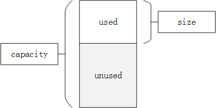

title: STL标准模板库
date: 2015-10-30 13:19:54
tags:
- c++
- STL
categories: 学习
---

STL是标准模板库,是一些容器的集合。vector是STL中最常见的容器,它是一种顺序容器,支持随机访问。vector是一块连续分配的内存,从数据安排的角度来讲,和数组极其相似,不同的地方就是：数组是静态分配空间,一旦分配了空间的大小,就不可再改变了；而vector是动态分配空间,随着元素的不断插入,它会按照自身的一套机制不断扩充自身的容量。

 C++队列queue是一种容器适配器,它给予程序员一种先进先出(FIFO)的数据结构。
 C++ STL中标准关联容器set, multiset, map, multimap内部采用的是一种非常高效的平衡检索二叉树：红黑树。
<!--more-->

## 1.vector基本用法
**vector: 内部实现是数组,一段连续的内存。**vector是C++标准模板库中的部分内容,它是一个多功能的,能够操作多种数据结构和算法的模板类和函数库。vector之所以被认为是一个容器,是因为它能够像容器一样存放各种类型的对象,简单地说,vector是一个能够存放任意类型的动态数组,能够增加和压缩数据。

<div align=center>
**vector的大小：size,vector的容量：capacity。**size表示vector中已有元素的个数,capacity表示vector最多可存储的元素的个数。为了降低二次分配时的成本,vector实际配置的大小可能比客户需求的更大一些,以备将来扩充,即capacity>=size。当等于时,容器此时已满,若再要加入新的元素时,就要重新进行内存分配,整个vector的数据都要移动到新内存。二次分配成本较高,在实际操作时,应尽量预留一定空间,避免二次分配。当vector的容量不足以插入count个元素,即capacity &lt;size + count需要进行二次分配,扩大vector的容量。在VS下,vector容量会扩大50%,即 capacity = capacity+ capacity / 2; 若仍不足,则 capacity = size + count。

* **头文件** #include &lt;vector &gt;, 命名域std(using std:vector), 建议使用全局的命名域(using namespace std);
* **创建vector对象**, vector &lt;int &gt; vec;
* **尾部插入元素a**, vec.push_back(a);
* **使用下标访问元素**, cout<<vec[0]<<endl;
* **使用迭代器访问元素**

```cpp
	vector<int>::iterator it;
	for(it=vec.begin();it!=vec.end();it++)
		cout<<*it<<endl;
```

* **插入元素**, vec.insert(vec.begin()+i,a); 在第i+1个元素前面插入a;
* **删除元素**, vec.erase(vec.begin()+2); 删除第3个元素;
  vec.erase(vec.begin()+i,vec.begin()+j); 删除区间[i,j-1],区间从0开始
  iterator erase(   iterator _Where); 
  iterator erase(   iterator _First,   iterator _Last); 
  如果是删除指定位置的元素时： 
  返回值是一个迭代器,指向删除元素下一个元素; 
  如果是删除某范围内的元素时：返回值也表示一个迭代器,指向最后一个删除元素的下一个元素;
* **向量大小**, vec.size();
* **清空**, vec.clear();

```cpp
#include<vector>
#include<iostream>
using namespace std;
#define a 101
int main()
{
	int i;
	vector<int> vec;//创建vector对象
	for(i=0;i<10;i++)
	{
		vec.push_back(i);//尾部插入元素
	}
	cout<<vec.size()<<endl;;//向量大小
	//vec.insert(vec.begin()+i,a);//在第i+1个元素面前插入元素a
	vec.insert(vec.begin()+3,a);//在第4个元素前面插入元素a
	vec.erase(vec.begin()+2);//删除第3个元素
	//vec.erase(vec.begin()+i,vec.end()+j);删除区间[i,j-1];区间从0开始
	vec.erase(vec.begin()+2,vec.begin()+5);
	
	for(i=0;i<vec.size();i++)
	{
		cout<<vec[i]<<",";
	}
	cout<<endl;
	//使用迭代器访问元素
	vector<int>::iterator it;
	for(it=vec.begin();it!=vec.end();it++)
		cout<<*it<<",";
	vec.clear();//清空
	system("pause");
}
```

## vector成员函数

vector还提供了很多接口,在下面的表中列出vector的成员函数和操作。

|函数     | 表述 |
|:-------|:-----|
|c.assign(beg,end),c.assign(n,elem)|将[beg; end)区间中的数据赋值给c,将n个elem的拷贝赋值给c。|
|c.at(idx)|传回索引idx所指的数据,如果idx越界,抛出out_of_range。|
|c.back()|传回最后一个数据,不检查这个数据是否存在。|
|c.begin()|传回迭代器重的可一个数据。|
|c.capacity()|返回容器中数据个数。|
|c.clear()|移除容器中所有数据。|
|c.empty()|判断容器是否为空。|
|c.end()|指向迭代器中的最后一个数据地址。|
|c.erase(pos),c.erase(beg,end)|删除pos位置的数据,传回下一个数据的位置;删除[beg,end)区间的数据,传回下一个数据的位置。|
|c.front()|传回第一个数据。|
|get_allocator|使用构造函数返回一个拷贝。|
|c.insert(pos,elem)|在pos位置插入一个elem拷贝,传回新数据位置。|
|c.insert(pos,n,elem)|在pos位置插入n个elem数据。无返回值。|
|c.insert(pos,beg,end)|在pos位置插入在[beg,end)区间的数据。无返回值。|
|c.max_size()|返回容器中最大数据的数量。|
|c.pop_back()|删除最后一个数据。|
|c.push_back(elem)|在尾部加入一个数据。|
|c.rbegin()|传回一个逆向队列的第一个数据。|
|c.rend()|传回一个逆向队列的最后一个数据的下一个位置。|
|c.resize(num)|重新指定队列的长度。|
|c.reserve()|保留适当的容量。|
|c.size()|返回容器中实际数据的个数。|
|c1.swap(c2),swap(c1,c2)|将c1和c2元素互换;同上操作
|vector<Elem> c|创建一个空的vector。|
|vector <Elem> c1(c2)|复制一个vector。|
|vector <Elem> c(n)|创建一个vector,含有n个数据,数据均已缺省构造产生。|
|vector <Elem> c(n, elem)|创建一个含有n个elem拷贝的vector。|
|vector <Elem> c(beg,end)|创建一个以[beg;end)区间的vector。|
|c.~ vector <Elem>()|销毁所有数据,释放内存。|

## 2.queue基本用法 
**queue用deque实现,deque内部实现是内存块的链表。**deque双向队列是一种双向开口的连续线性空间,可以高效的在头尾两端插入和删除元素,deque在接口上和vector非常相似。

* **头文件** #include &lt;queue &gt;;
* **创建queue对象**, queue &lt;int &gt; q1;queue &lt;double &gt; q2;
* **入队列-将x元素接到队列的末端**, q.push(x);
* **出队列**, q.pop()弹出队列的第一个元素,并不返回元素的值;
* **访问队首元素**, q.font();
* **访问队尾元素**, q.back();
* **队列中的元素的个数**, q.size();
* **判断队列空**, q.empty(),当队列空时,返回true。

```cpp
#include <iostream>  
#include <queue>  
using namespace std;  
int main()  
{  
    queue<int> que;  
	for(int i=0;i<10;i++)
       que.push(i);
	if(!que.empty())
		cout<<"队列不为空!"<<endl;
	int n=que.size();
	cout<<n<<endl;
	cout<<que.front()<<endl;
	cout<<que.back()<<endl;
	que.pop();
	cout<<que.front()<<endl;
	system("pause");
    return 0;  
}
```
* **priority_queue**, 在&lt;queue &gt;头文件中,还定义了一个非常有用的模板类priority_queue(优先队列)。优先队列与队列的差别在于优先队列不是按照入队的顺序出队,而是按照队列中元素的优先权顺序出队列(默认为大者优先,也可以通过指定算子来指定自己的优先顺序)。

priority_queue模板类有三个模板参数,第一个是元素类型,第二个容器类型,第三个是比较算子。其中后两个都可以省略,默认容器为vector,默认算子为less,即小的往前排,大的往后排(出队列时序列尾的元素出队列)。
```cpp
priority_queue<int> q1;
priority_queue< pair<int, int> > q2; 
priority_queue<int, vector<int>, greater<int> > q3; // 定义小的先出队
priority_queue 的基本操作与queue 相同。
```
## 3.stack基本用法
C++ stack(堆栈)是一个容器的改编,它实现了先进后出的数据结构(FILO)。stack的具体应用实例[有效的括号Valid Parentheses](https://leetcode-cn.com/problems/valid-parentheses/description/)。

* **头文件:** #include &lt;stack &gt;。
* **创建stack对象:** stack &lt;int &gt;s。
* **判断栈空:** empty(),当栈空时返回ture。
* **移除栈顶元素:** pop(),该操作只是删除栈顶的元素,并不返回该元素。	
* **在栈顶增加元素:** push(),如s.push(x)。
* **返回栈中元素数目:** size()。	
* **返回栈顶元素:** top()。
* **简单的例子：**	

```cpp
#include<iostream>  
#include<stack>  
using namespace std;  
int main(void)  
{  
    stack<double>s;//定义一个栈  
    for(int i=0;i<10;i++)  
        s.push(i);  
    while(!s.empty())  
    {  
        printf("%lf\n",s.top());  
        s.pop();  
    }  
    cout<<"栈内的元素的个数为："<<s.size()<<endl;  
    return 0;  
} 
```
## 4.map基本用法
map是STL的一个关联容器,它提供一对一（其中第一个可以称为关键字Key,每个关键字只能在map中出现一次,第二个可以称为该关键字的值Value）的数据处理能力,由于这个特性,它完成在我们处理一对一的数据的时候,在编程上提供快速的通道。map内部自建一颗[红黑树](http://www.cnblogs.com/fornever/archive/2011/12/02/2270692.html)（一种非严格的[平衡二叉树](http://blog.csdn.net/niteip/article/details/11840691)）,这棵树具有对数据的自动排序功能。map的具体应用实例[单词模式Word Pattern](https://leetcode-cn.com/problems/word-pattern/description/)。


* **头文件:** #include &lt; map &gt;
* **map最基本的构造函数**
自动建立Key － value的对应,key 和 value可以是任意你需要的类型。

```cpp
map<string , int >mapstring;       map<int ,string >mapint;
map<sring, char>mapstring;         map< char ,string>mapchar;
map<char ,int>mapchar;            map<int ,char >mapint；
```

* **map中插入元素**

**第一种：用insert函数插入pair数据**
pair是一种模版类型。每个pair可以存储两个值。这两种值无限制。也可以将自己写的struct的对象放进去。

```cpp
#include <map>  
#include <string>  
#include <iostream>  
using namespace std;  
int main()  
{  
   map<int, string> mapStudent;
   //pair<int,string>p;p=make_pair(v1,v2);make_pair()返回类型为对应的pair类型  
   mapStudent.insert(pair<int, string>(1, "student_one"));  
   mapStudent.insert(pair<int, string>(2, "student_two"));  
   mapStudent.insert(pair<int, string>(3, "student_three"));  
   map<int, string>::iterator  iter;  
   for(iter = mapStudent.begin(); iter != mapStudent.end(); iter++)  
   {  
      cout<<iter->first<<"  "<<iter->second<<endl;  
   }  
}  
```

**第二种:用insert函数插入value_type数据**

```cpp
#include <map>  
#include <string>  
#include <iostream>  
using namespace std;  
int main()  
{  
   map<int, string> mapStudent;  
   mapStudent.insert(map<int, string>::value_type (1, "student_one"));  
   mapStudent.insert(map<int, string>::value_type (2, "student_two"));  
   mapStudent.insert(map<int, string>::value_type (3, "student_three"));  
   map<int, string>::iterator  iter;  
   for(iter = mapStudent.begin(); iter != mapStudent.end(); iter++)  
   {  
       cout<<iter->first<<" "<<iter->second<<endl;  
   }  
}  
```

**第三种:用数组的方式插入数据**

```cpp
#include <map>  
#include <string>  
#include <iostream>  
using namespace std;  
int main()  
{  
   map<int, string> mapStudent;  
   mapStudent[1] =  "student_one";  
   mapStudent[2] =  "student_two";  
   mapStudent[3] =  "student_three";  
   map<int, string>::iterator  iter;  
   for(iter = mapStudent.begin(); iter != mapStudent.end(); iter++)  
   {  
      cout<<iter->first<<"   "<<iter->second<<endl;  
   }  
}  
```

* **map的大小**
在往map里面插入了数据,我们怎么知道当前已经插入了多少数据呢,可以用size函数。

```cpp
int nSize = mapStudent.size();  
```

* **map查找元素**

**第一种:用count函数来判定关键字是否出现**
其缺点是无法定位数据出现位置,由于map的特性,一对一的映射关系,就决定了count函数的返回值只有两个,要么是0,要么是1,出现的情况,当然是返回1了。

```cpp
#include <map>  
#include <string>  
#include <iostream>  
using namespace std;  
int main()  
{  
	map<string,int> test;
	test.insert(make_pair("test1",1));
	test.insert(make_pair("test2",2));

	//如果map中存在所要查找的主键,就返回一
	int count = test.count("test2");
	cout<<"the value of count:"<<count<<endl;
	map<string,int>::iterator it = test.find("test2");

	//如果map中没有索要查找的主键,就返回map.end();
	if(it != test.end())
		cout<<"has find the string"<<endl;
	system("pause");
}  
```

**第二种:用find函数来定位数据出现位置**

它返回的一个迭代器,当数据出现时,它返回数据所在位置的迭代器,如果map中没有要查找的数据,它返回的迭代器等于end函数返回的迭代器。

```cpp
#include <map>  
#include <string>  
#include <iostream>  
using namespace std;  
int main()  
{  
   map<int, string> mapStudent;  
   mapStudent.insert(pair<int, string>(1, "student_one"));  
   mapStudent.insert(pair<int, string>(2, "student_two"));  
   mapStudent.insert(pair<int, string>(3, "student_three"));  
   map<int, string>::iterator iter;  
   iter = mapStudent.find(1);  
   if(iter != mapStudent.end())  
  {  
       cout<<"Find, the value is "<<iter->second<<endl;  
   }  
   else  
   {  
       cout<<"Do not Find"<<endl;  
   }  
}  
```

**第三种:Lower_bound函数和Upper_bound函数**

Lower_bound函数用法,这个函数用来返回要查找关键字的下界(是一个迭代器),Upper_bound函数用法,这个函数用来返回要查找关键字的上界(是一个迭代器)。
lower_bound(k)返回一个迭代器,指向键不小于k的第一个元素。
upper_bound(k)返回一个迭代器,指向键大于k的第一个元素
例如：map中已经插入了1,2,3,4的话,如果lower_bound(2)的话,返回的2,而upper-bound（2）的话,返回的就是3。
Equal_range函数返回一个pair,pair里面第一个变量是Lower_bound返回的迭代器,pair里面第二个迭代器是Upper_bound返回的迭代器,如果这两个迭代器相等的话,则说明map中不出现这个关键字。

```cpp
#include <map>  
#include <string>  
#include <iostream>  
using namespace std;  
int main()  
{  
	map<int, string> mapStudent;  
	mapStudent[1] =  "student_one";  
	mapStudent[3] =  "student_three";  
	mapStudent[5] =  "student_five";  
	map<int, string>::iterator  iter;  
	iter = mapStudent.lower_bound(2);  
	{  
		//返回的是下界3的迭代器  
		cout<<iter->second<<endl;  
	}  
	iter = mapStudent.lower_bound(3);  
	{  
		//返回的是下界3的迭代器  
		cout<<iter->second<<endl;  
	}  
	iter = mapStudent.upper_bound(2);  
	{  
		//返回的是上界3的迭代器  
		cout<<iter->second<<endl;  
	}  
	iter = mapStudent.upper_bound(3);  
	{  
		//返回的是上界5的迭代器  
		cout<<iter->second<<endl;  
	}  
	pair<map<int, string>::iterator, map<int, string>::iterator> mapPair;  
	mapPair = mapStudent.equal_range(2);  
	if(mapPair.first == mapPair.second)  
	{  
		cout<<"Do not Find"<<endl;  
	}  
	else  
	{  
		cout<<"Find"<<endl;  
	}  
	mapPair = mapStudent.equal_range(3);  
	if(mapPair.first == mapPair.second)  
	{  
		cout<<"Do not Find"<<endl;  
	}  
	else  
	{  
		cout<<"Find"<<endl;  
	}  
}  
```

* **map数据的清空与判断**

清空map中的数据可以用clear()函数,判定map中是否有数据可以用empty()函数,它返回true则说明是空map。

* **map数据的删除**

这里要用到erase函数,它有三个重载了的函数。

```cpp
iterator erase(iterator it); //通过一个条目对象删除 
iterator erase(iterator first, iterator last); //删除一个范围 
size_type erase(const Key& key); //通过关键字删除 
clear()就相当于 enumMap.erase(enumMap.begin(), enumMap.end());
```

```cpp
#include <map>  
#include <string>  
#include <iostream>  
using namespace std;  
int main()  
{  
   map<int, string> mapStudent;  
   mapStudent.insert(pair<int, string>(1, "student_one"));  
   mapStudent.insert(pair<int, string>(2, "student_two"));  
   mapStudent.insert(pair<int, string>(3, "student_three"));  
   //如果你要演示输出效果,请选择以下的一种,你看到的效果会比较好  
   //如果要删除1,用迭代器删除  
   map<int, string>::iterator iter;  
   iter = mapStudent.find(1);  
   mapStudent.erase(iter);  
   //如果要删除1,用关键字删除  
   int n = mapStudent.erase(1);//如果删除了会返回1,否则返回0  
   //用迭代器,成片的删除  
   //一下代码把整个map清空  
   mapStudent.earse(mapStudent.begin(), mapStudent.end());  
   //成片删除要注意的是,也是STL的特性,删除区间是一个前闭后开的集合  
}  
```

* **map的基本操作函数**

|函数     | 表述 |
|:-------|:-----|
|begin()          |返回指向map头部的迭代器
|clear(）         |删除所有元素
|count()          |返回指定元素出现的次数
|empty()          |如果map为空则返回true
|end()            |返回指向map末尾的迭代器
|equal_range()    |返回特殊条目的迭代器对
|erase()          |删除一个元素
|find()           |查找一个元素
|get_allocator()  |返回map的配置器
|insert()         |插入元素
|key_comp()       |返回比较元素key的函数
|lower_bound()    |返回键值>=给定元素的第一个位置
|max_size()       |返回可以容纳的最大元素个数
|rbegin()         |返回一个指向map尾部的逆向迭代器
|rend()           |返回一个指向map头部的逆向迭代器
|size()           |返回map中元素的个数
|swap()           |交换两个map
|upper_bound()    |返回键值>给定元素的第一个位置
|value_comp()     |返回比较元素value的函数

## 5.list基本用法
**list是一个线性双向链表结构**,它的数据由若干个节点构成,每个节点都包括一个信息块(即实际存储的数据)、一个前驱指针和一个后驱指针。它无需分配指定的内存大小且可以任意伸缩。list将元素按顺序储存在链表中. 与向量(vector)相比,它**允许快速的插入和删除,但是随机访问却比较慢。**

* **头文件**, #include &lt;list &gt;
* **构造析构**
```cpp
list<Elem> c //创建一个空的list 
list<Elem> c1(c2) //复制另一个同类型元素的list 
list<Elem>c(n) //创建n个元素的list,每个元素值由默认构造函数确定 
list<Elem>c(n,elem) //创建n个元素的list,每个元素的值为elem 
list<Elem>c(begin,end) //由迭代器创建list,迭代区间为[begin,end) 
c.~list();       // 销毁所有元素,释放内存 
```
* **插入元素**
```cpp
c.push_back(Elem) //list元素尾部增加一个元素
c.push_front(Elem) //list元素首元素前添加一个元素
c.insert(pos,Elem) //在pos位置插入一个Elem拷贝,返回新数据的位置 
c.insert(pos,n,Elem) //在pos位置插入n个Elem数据,无返回值  
c.insert(pos,begin,end)//在pos位置插入在[begin,end)区间的数据,无返回值 
```
* **数据访问**
```cpp
c.front() //返回第一个数据 
c.back() //返回最后一个数据 
c.begin() //返回指向第一个元素的迭代器(指针) 
c.end() //返回指向最后一个数据的下一个位置的迭代器(指针) 
c.rbegin() 
//返回逆向队列的第一个数据,也就是返回容器中倒数第一个元素的迭代器 
c.rend() 
//返回指向逆向队列的最后一个数据的下一个位置的迭代器, 
//也就是返回容器中倒数最后一个元素之后的迭代器 
```
* **删除元素**
```cpp
c.pop_back() //删除容器尾元素,当且仅当容器不为空  
c.pop_front() //删除容器首元素,当且仅当容器不为空  
c.remove(Elem) //删除容器中所有元素值等于x的元素  
/*
 remove_if()删除条件满足的元素(会遍历一次链表) 
*/ 
void remove_if_test(){  
ShowList(g_list1);  
g_list1.remove_if(myFun);  
ShowList(g_list1);  
}  

c.clear() //删除容器中的所有元素  
c.erase(pos) //删除pos位置的数据,返回下一个数据的位置  
c.erase(begin,end) 
//删除[begin,end)区间的数据,返回下一个数据的位置  
c.unique() //删除相邻重复元素  
//示例  
L1( 1, 1 ,4,3,5,1)  
L1.unique( );     // L1(1,4,3,5,1)  
```
* **其它**

|函数   | 表述|
|:-------|:-----|
|c.empty()|list是否为空|
|c.reverse()|反转链表|
|c.sort()|将链表排序,默认升序|
|c.sort(comp)|自定义回调函数实现自定义排序|
|c1.merge(c2)|合并2个有序的链表并使之有序,从新放到c1里,释放c2|
|c1.merge(c2,comp)|合并2个有序的链表并使之按照自定义规则排序之后从新放到c1中,释放c2|
|c1.swap(c2)或者swap(c1,c2)|将c1和c2交换|
|resize(n)|从新定义链表的长度,超出原始长度部分用0代替,小于原始部分删除|
|resize(n,num) |从新定义链表的长度,超出原始长度部分用num代替|

```cpp
#include<iostream>
#include<list>
using namespace std;

int main()
{
	list<int> c1(3);
	//list<int> c1(3,2);
	list<int> c2;
	list<int>::iterator it;
	if(!c1.empty())//是否为空
	{
		cout<<"c1 is not empty"<<endl;
		cout<<c1.size()<<endl;//元素个数
		for(it=c1.begin();it!=c1.end();it++)
		{
			cout<<*it<<" ";
		}
		cout<<endl;
	}
	//添加元素
	c1.push_front(1);
	c1.push_back(2);
	c2.push_front(11);
	c2.push_back(12);
	c2.insert(c2.begin(),13);

	//删除元素
	c1.pop_back();// 删除末尾的元素
	c2.pop_front();//删除第一个元素

	cout<<c1.front()<<","<<c2.back()<<endl; //返回链表元素。
	c1.reverse();	//反转链表
	c1.merge(c2);  //合并链表,合并后销毁c2

	for(it=c1.begin();it!=c1.end();it++)
	{
		cout<<*it<<" ";
	}
	cout<<endl;
	for(it=c2.begin();it!=c2.end();it++)
	{
		cout<<*it<<" ";
	}
	cout<<endl;
	system("pause");
	return 0;
}
```
## 6.set基本用法
set集合容器：实现了红黑树的平衡二叉检索树的数据结构,插入元素时,它会自动调整二叉树的排列,把元素放到适当的位置,以保证每个子树根节点键值大于左子树所有节点的键值,小于右子树所有节点的键值；另外,还得保证根节点左子树的高度与右子树高度相等。

set和multiset会根据特定的排序准则,自动将元素进行排序。不同的是后者允许元素重复而前者不允许。

* **头文件** #include &lt;set &gt;, 命名域std(using std:vector), 建议使用全局的命名域(using namespace std);
* **创建set对象**, set &lt;int &gt; s;
* **常用方法**

|函数     | 表述 |
|:-------|:-----|
|insert()|插入元素s.insert(1);|
|begin()|返回set容器的第一个元素*s.begin()|
|end() |返回set容器的最后一个元素*s.end()|
|clear()|删除set容器中的所有的元素|
|empty()|判断set容器是否为空s.empty()|
|size()|返回当前set容器中的元素个数s.size()|
|max_size() |返回set容器可能包含的元素最大个数s.max_size()|
|rbegin　|返回的值和end()相同|
|rend()|返回的值和rbegin()相同|
|count()|用来查找set中某个某个键值出现的次数,只有0次和1次s.count(1)|
|find()|返回给定值值得定位器,如果没找到则返回end()|

```cpp
#include <iostream>
#include <set>
#include<functional>  
using namespace std;

int main()
{
	set<int> s;//默认为升序
	set<int, greater<int>>s2;//由于greater<>是个函数,降序,所以要加这个头文件#include<functional>
	multiset<int> s3;//multiset允许插入重复值
	s.insert(2);
	s.insert(100);
	s.insert(1);
	s.insert(1);//元素1已经存在,所以不会再次插入1
	s2.insert(3);
	s2.insert(2);
	s3.insert(10);
	s3.insert(3);
	s3.insert(3);//元素3已经存在,但是会再次插入3
	set<int>::iterator it;
	cout << "set 的 size 值为 ：" << s.size() << endl;
	cout << "set 的 maxsize的值为 ：" << s.max_size() << endl;
	cout << "set 中的第一个元素是 ：" << *s.begin() << endl;
	for (it = s.begin(); it != s.end(); it++)
	{
		cout << *it << " ";
	}
	cout << endl;
	for (it = s2.begin(); it != s2.end(); it++)
	{
		cout << *it << " ";
	}
	cout << endl;
	for (it = s3.begin(); it != s3.end(); it++)
	{
		cout << *it << " ";
	}
	cout << endl;
	set<int>::iterator itor;
	itor = s.find(2);
	if (itor != s.end()) // itor point to s.end() if not found
		cout << "found"<<endl;
	else
		cout << "not found"<<endl;
	if (s.count(4) == 1) // return 1 if s contains 4, else 0
		cout << "s contains 4" << endl;
	else
		cout << "s does not contains 4" << endl;
	system("pause");
	return 0;
}
```

参考：
* [STL vector用法介绍](http://blog.csdn.net/phoebin/article/details/3864590)
* [STL vector的内部实现原理及基本用法](https://blog.csdn.net/u012658346/article/details/50725933)
* [STL中队列（queue）的使用方法](http://blog.csdn.net/acmtl/article/details/53579794)
* [STL系列之一 deque双向队列](http://blog.csdn.net/morewindows/article/details/6946811)
* [c++stack容器介绍](http://blog.csdn.net/chao_xun/article/details/8037420)
* [map的详细用法](http://blog.csdn.net/sunshinewave/article/details/8067862)
* [C++ map的基本操作和用法](http://blog.csdn.net/seanyxie/article/details/5804974)
* [C++ List的用法(整理)](http://blog.csdn.net/lskyne/article/details/10418823)
* [STL之list容器详解](http://www.cnblogs.com/scandy-yuan/archive/2013/01/08/2851324.html)
* [STL之五：set/multiset用法详解](http://blog.csdn.net/longshengguoji/article/details/8546286)
* [STL中的set容器的一点总结](http://www.cnblogs.com/BeyondAnyTime/archive/2012/08/13/2636375.html)