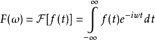
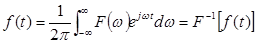

title: 数据挖掘-特征提取
date: 2015-11-15 19:14:11
tags:
- 数据挖掘
- 特征提取
categories: 科研
---
数据挖掘如今在各个领域起到的作用越来越大，学习数据挖掘首先要了解数据挖掘十大算法，网易公开课中提供了一个machine learning学习入门较好的课程[Andrew Ng 的 Machine Learning 课程](http://v.163.com/special/opencourse/machinelearning.html)。入门后可以学习几本不错的书，如Bishop 的 Pattern Recognition and Machine Learning，elements of statistical learning和Machine Learning A Probabilistic Perspective也是非常好的参考书。此外也可以看看一些相关会议的论文,包括 SIGMOD, KDD, ICDM, ICML, NIPS, IJCAI, AAAI 等等。本博客介绍数据挖掘中用于特征提取方法：1.主成分分析（PCA）;2.独立成分分析（ICA）;3.Gabor变换;4.匹配追踪。
<!--more-->

## 1.主成分分析PCA

#### （1）PCA简介
* **主成分分析PCA(Principle Component Analysis)**:将多个变量通过线性变换以选出较少个数重要变量的一种多元统计分析方法，又称主分量分析。

* **主成分分析PCA原理**:在用统计分析方法研究多变量的课题时，变量个数太多就会增加课题的复杂性。人们自然希望变量个数较少而得到的信息较多。在很多情形，变量之间是有一定的相关关系的，当两个变量之间有一定相关关系时，可以解释为这两个变量反映此课题的信息有一定的重叠。主成分分析是对于原先提出的所有变量，将重复的变量（关系紧密的变量）删去多余，建立尽可能少的新变量，使得这些新变量是两两不相关的，而且这些新变量在反映课题的信息方面尽可能保持原有的信息。
设法将原来变量重新组合成一组新的互相无关的几个综合变量，同时根据实际需要从中可以取出几个较少的综合变量尽可能多地反映原来变量的信息的统计方法叫做主成分分析或称主分量分析，也是数学上用来降维的一种方法。

* **主成分分析PCA思想**:将n维特征映射到k维上(k<n)这k维是全新的正交特征。这k维特征称为主元，是重新构造出来的k维特征，而不是简单地从n维特征中去除其余n-k维特征

#### （2）PCA分析
* **PCA的优点**
1. 可消除评价指标之间的相关影响:因为主成分分析在对原指标变量进行变换后形成了彼此相互独立的主成分，而且实践证明指标之间相关程度越高，主成分分析效果越好。
2. 可减少指标选择的工作量:对于其它评价方法，由于难以消除评价指标间的相关影响，所以选择指标时要花费不少精力，而主成分分析由于可以消除这种相关影响，所以在指标选择上相对容易些。
3. 当评级指标较多时还可以在保留绝大部分信息的情况下用少数几个综合指标代替原指标进行分析。
4. 在综合评价函数中，各主成分的权数为其贡献率，它反映了该主成分包含原始数据的信息量占全部信息量的比重，这样确定权数是客观的、合理的，它克服了某些评价方法中认为确定权数的缺陷。
5. 这种方法的计算比较规范，便于在计算机上实现，还可以利用专门的软件。

* **PCA缺点**
1. 在主成分分析中，我们首先应保证所提取的前几个主成分的累计贡献率达到一个较高的水平（即变量降维后的信息量须保持在一个较高水平上），其次对这些被提取的主成分必须都能够给出符合实际背景和意义的解释(否则主成分将空有信息量而无实际含义)。
2. 主成分的解释其含义一般多少带有点模糊性，不像原始变量的含义那么清楚、确切，这是变量降维过程中不得不付出的代价。因此，提取的主成分个数m通常应明显小于原始变量个数p(除非p本身较小)，否则维数降低的“利”可能抵不过主成分含义不如原始变量清楚的“弊”。

* **PCA适用范围**
1. 适用数据:多变量存在一定相关性,只对符合高斯分布的样本点比较有效。
2. 适用范围:应用于去噪，降维：例如数据表示，模式识别、图像信息压缩、城市道路交通，水质环境评价.....

#### （3）PCA计算
PCA的计算过程涉及到矩阵相关的很多操作，具体计算过程我参考的是[JerryLead 博客园](http://www.cnblogs.com/jerrylead/archive/2011/04/18/2020209.html),用一个实例详细讲解其具体计算过程，非常清楚，也就是降维的过程以及其数学上的理论基础。其中从n维降到k维的k值确定，则是根据特征向量的值需要占到特征向量值总和的百分比确定的。除了这篇博客以外，还有一篇文章[A tutorial on Principal Components Analysis](http://www.sccg.sk/~haladova/principal_components.pdf)讲解的非常详细。

## 2.独立成分分析ICA

#### （1）ICA简介
* **独立成分分析ICA(Independent Component Analysis)**： ICA是一种用来从多变量（多维）统计数据里找到隐含的因素或成分的方法，被认为是主成分分析（Principal Component Analysis, PCA）和因子分析（Factor Analysis）的一种扩展。对于盲源分离问题，ICA是指在只知道混合信号，而不知道源信号、噪声以及混合机制的情况下，分离或近似地分离出源信号的一种分析过程。

* **独立成分分析ICA在维基百科中的解释是**：一种利用统计原理进行计算的方法它是一个线性变换。这个变换把数据或信号分离成统计独立的非高斯的信号源的线性组合。独立成分分析是盲信号分离（Blind source separation）的一种特例。

* **典型实例**:“鸡尾酒会”的问题,假设在party中有n个人，他们可以同时说话，我们也在房间中一些角落里共放置了n个声音接收器（Microphone）用来记录声音。宴会过后，我们从n个麦克风中得到了一组数据{$x^{(i)}(x_1^i,x_2^i,...,x_n^i);i=1,2,...,m$}，i表示采样的时间顺序，也就是说共得到了m组采样，每一组采样都是n维的。我们的目标是单单从这m组采样数据中分辨出每个人说话的信号。

#### （2）ICA分析
* **ICA约束**
1. 独立成分被假定是统计独立的（技术角度上理解：联合概率密度等于各边缘概率密度的乘积）
2. 独立成分具有非高斯的分布
3. 假定混合矩阵是方阵（就是独立成分的个数与观测到的混合量个数相同）

* **ICA优点**
消除指标的影响和指标选取的工作量

* **ICA缺点**
独立成分分析并不能完全恢复信号源的具体数值，也不能解出信号源的正负符号、信号的级数或者信号的数值范围。

* **ICA适用范围**
1. 适用数据:非高斯分布的样本点
2. 适用范围：应用于去噪、降维、信号分离：例如码分多址通信、雷达信号分选、心电图（胎儿）、脑电图、图像压缩、图像融合.....

#### （3）ICA计算
ICA的计算过程涉及到许多数学知识，具体计算过程我参考的是[JerryLead 博客园](http://www.cnblogs.com/jerrylead/archive/2011/04/19/2021071.html),虽然讲解的很详细，以及有些公式还有其具体推到过程，但是对数学要求很高（由于很多数学知识忘了，公式中有些计算不是很理解）。

#### （4）PCA和ICA对比

* PCA(principal components analysis)就是主成分分析，是数据分析中常用到的一种方法。它是找出数据最主要的方向，并将数据向该方向投影。ICA(Independent components analysis)就是独立成分分析。

* PCA与ICA的区别主要在于假设条件不同。PCA假设数据是呈高斯或者说指数分布的，而ICA则假设数据是相互独立的。所以在实际处理中，ICA在小样本集时效果较好，而对于大样本集，PCA也能达到很好的效果。因为实际采样中，当采样样本较大时，其一般是呈高斯分布的。
PCA的几个主要假设包括：
1.处理数据集是线性的，对于非线性问题，有核化PCA可以进行处理，该方法主要是利用非线性权值对线性PCA进行扩展。
2.PCA是使用中值和方差来进行概率分布的描述，而这种方法仅适用于样本呈指数分布的情形，所以PCA假设数据时呈高斯分布的。
3.PCA隐含着假设：数据具有较高的信噪比，所以具有最大方差的方向被作为主元，而方差最小的方向被作为噪声，这是由低通滤波器的特性决定的。
4.主元正交：PCA假设主元之间是正交的，这样假设有利于采用线性代数的方法进行求解。

* PCA和ICA性能的比较：
由于PCA假设的是样本呈高斯分布，所以其在大样本情况下效果较好，而ICA假设样本彼此独立，其效果受样本数量影响不大。
对于实验效果，PCA的约束条件是要求各分量不相关，而ICA则是要求严格独立，显然ICA约束比PCA要强很多，所以ICA的特征提取能力比PCA要强很多。

## 3.Gabor变换

#### （1）Gabor变换简介
* **伽柏（Gabor）变换**：Gabor变换是一种加窗短时傅立叶(Fourier)变换（Window Fourier transform or Short Time Fourier Transform）,Gabor函数可以在频域不同尺度、不同方向上提取相关的特征。Gabor变换是短时Fourier变换中当窗函数取为高斯函数时的一种特殊情况。

* **Gabor变换的基本思想**：把信号划分成许多小的时间间隔，用Fourier变换分析每一个时间间隔，以便确定信号在该时间间隔存在的频率。其处理方法是对f(t)加一个滑动窗，再作Fourier变换。

* **Gabor变换的本质**:实际上还是对二维图像求卷积。因此二维卷积运算的效率就直接决定了Gabor变换的效率。

* **Fourier变换**:是整体上将信号分解为不同的频率分量（任何信号都可分解为复正弦信号之和），对确定性信号及平稳信号使用。其缺点为缺乏时间的局部性信息，并且对时变信号、非平稳信号的分析存在严重不足，(1)无法告知某些频率成分发生在哪些时间内；(2)无法告知某个时刻信号频谱的分布情况。
1. Fourier变换将时域信号发f(t)转换到频域信号：

2. Fourier逆变换将频域信号转换到时域信号：

其中信号f(t)在任一有限区间满足狄利克雷条件:(1)在一周期内，如果有间断点存在，则间断点的数目应是有限个;(2)在一周期内，极大值和极小值的数目应是有限个;(3)在一周期内，信号是绝对可积的。并且f(t)在$(-\infty,+\infty)$上绝对可即。

对于Fourier变换网上有很多讲解，如果最开始对Fourier变换没有一点了解，可以看一下这篇[博客](http://blog.jobbole.com/69407/),让你更清楚的认识Fourier变换。

#### （2）Gabor变换分析
* **Gabor变换优点**
在提取目标的局部空间和频率域信息方面具有良好的特性。

* **Gabor变换的缺点**
Gabor变换在一定程度上解决了局部分析的问题，但对于突变信号和非平稳信号仍难以得到满意的结果，即Gabor变换仍存在着较严重的缺陷。
1. Gabor变换的时频窗口大小、形状不变，只有位置变化，而实际应用中常常希望时频窗口的大小、形状要随频率的变化而变化，因为信号的频率与周期成反比，对高频部分希望能给出相对较窄的时间窗口，以提高分辨率，在低频部分则希望能给出相对较宽的时间窗口，以保证信息的完整性，总之是希望能给出能够调节的时频窗；
2. Gabor变换基函数不能成为正交系，因此为了不丢失信息，在信号分析或数值计算时必须采用非正交的冗余基，这就增加了不必要的计算量和存储量。

**无论研究低频成分还是研究高频成分，Gabor变换所采用的时间-频率窗口的宽度和高度都不变，这对研究较高频率或者较低频率都不利。**

* **Gabor变化适用范围**:非平稳信号。例如可应用于(1)暂态信号检测(2)图象分析与压缩

很多博客里面都讲解到了[二维卷积运算](http://blog.csdn.net/augusdi/article/details/11232445)和[Gabor定义](http://www.cnblogs.com/emouse/p/3611256.html),以及[Gabor函数](http://blog.sina.com.cn/s/blog_75e063c10101455s.html),《非平稳信号特征提取方法及其应用——范虹 著》中的Gabor展开。

## 4.匹配追踪

#### （1）匹配追踪简介
* **匹配追踪**:由Mallat等和Qian等基于投影追踪算法提出的逐步递推算法，是一种自适应分解算法。

* **匹配追踪分解信号的关键**:在于找出一系列时频原子，这些时频原子通过逐次分解信号得到。在每一步分解过程中，都寻求与残余信号最为相似的时频原子。

#### （2）匹配追踪分析
* **匹配追踪优点**
匹配追踪算法在思想上摆脱了传统小波分析基于二分频带的约束，是小波框架理论的发展。对于那些单纯使用Fourier基或小波基难以有效表示的高温非平稳信号，应用该算法都可以很好的表示。

* **匹配追踪缺点**
1. 算法实现计算量太大。
2.不以得到全局最优解
3. 时频原子的选取与构造比较困难
针对这些缺点，人们尝试采用遗传算法实现匹配追踪的分解，以降低匹配追踪算法的计算量。

#### （3）信号分析方法
* **平稳信号处理方法**
1. 时域分析方法:概率分析法、时域同步平均法、相关分析法，提取信号的幅值、周期、频率、相位以及均值、方差、方根、方根幅值、均方根值、峰值、偏斜度、峭度、波形指标、峰值指标、脉冲指标、裕度指标。
2. 频域分析方法:频谱分析、倒频谱分析、包络分析。

* **非平稳信号时频分析方法**
Gabor变换，短时Fourier变换、小波分析、双线性时频分析法、自适应信号分解(匹配追踪)、Hilbert-Huang时频分析法
