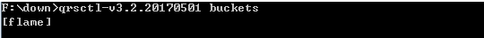
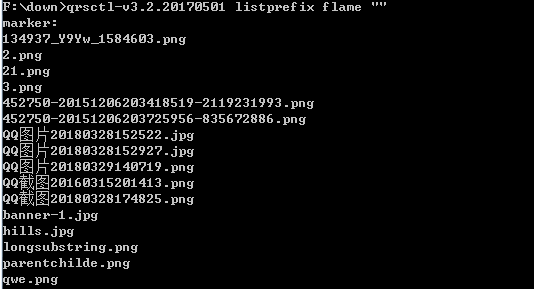
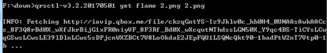

本博客之前的图片一直是用七牛云存储的,今天发现博客图片外链全都失效了,七牛云存储图片全部都无法显示,七牛云收回了所有的测试域名,并且七牛云后台也无法显示和下载图片。为了解决这个问题,可以使用[qrsctl](https://developer.qiniu.com/kodo/tools/1300/qrsctl)工具下载图片,然后使用hexo-asset-image添加本地图片。
<!--more-->

## 1.七牛云图片下载(Windows)

* 下载官方提供的小工具: [https://developer.qiniu.com/kodo/tools/1300/qrsctl]([https://developer.qiniu.com/kodo/tools/1300/qrsctl), 下载的文件名为: **qrsctl-v3.2.20170501**

* 按键 **win + r** 然后输入 **cmd** 调出命令行窗口,进入文件路径,输入以下命令:
```{bash}
qrsctl-v3.2.20170501 login 七牛云账号 七牛云密码
```

* 执行下面的命令查看你的 bucket
```{bash}
qrsctl-v3.2.20170501 buckets
```


* 执行下面的命令查看bucket里面的文件. 注意替换为你自己的bucket名称
```{bash}
qrsctl-v3.2.20170501 listprefix flame ""
```


* 执行下面的命令下载文件, 注意替换自己的bucket名称和文件名称
```{bash}
qrsctl-v3.2.20170501 get flame 2.png 2.png
```


## 2.Hexo中添加本地图片

* 把主页配置文件_config.yml里的post_asset_folder:这个选项设置为true

* 在你的hexo目录下执行以下命令,这是下载安装一个可以上传本地图片的插件
```{bash}
npm install hexo-asset-image --save
```

* 运行hexo n "xxxx"来生成md博文时,/source/_posts文件夹内除了xxxx.md文件还有一个同名的文件夹

* 最后在xxxx.md中想引入图片时,先把图片复制到xxxx这个文件夹中,然后只需要在xxxx.md中按照markdown的格式引入图片：
```{bash}

```

注意： xxxx是这个md文件的名字,也是同名文件夹的名字。只需要有文件夹名字即可,不需要有什么绝对路径。你想引入的图片就只需要放入xxxx这个文件夹内就好了,很像引用相对路径。


参考：
[七牛云图片外链失效的解决办法](https://blog.csdn.net/geekqian/article/details/84728943)
[Hexo中添加本地图片](https://www.cnblogs.com/codehome/p/8428738.html?utm_source=debugrun&utm_medium=referral)