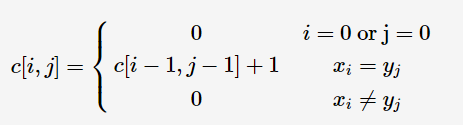
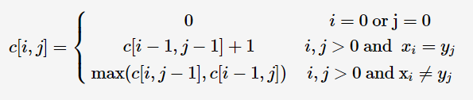
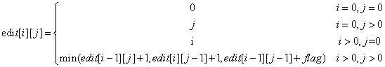
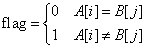
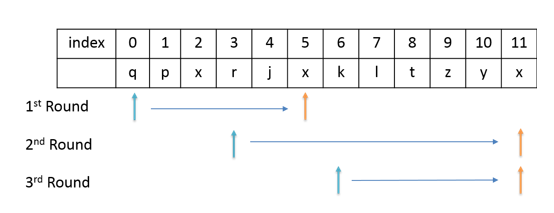

title: 数组字符串相关算法
date: 2016-11-30 14:37:15
tags:
- c++
- LeetCode
categories: algorithm
---
数组字符串相关的经典算法：
1.最大连续子序列和（Maximum Subarray） 2.最长递增子序列（Longest Increasing Subsequence）
3.最长公共子串（Longest Common Substirng） 4.最长公共子序列（Longest Common Subsequence）
5.字符串编辑距离（Edit Distance） 6.最长不重复字串（Longest Substring Without Repeating Characters）
7.最长回文子串（Longest Palindromic Substring） 8.最长公共前缀（Longest Common Prefix）
9.两个排序数组的中位数（Median of Two Sorted Arrays）
<!--more-->

## 1.最大连续子序列和

题目的目的是要找出由数组成的一维数组中和最大的连续子序列。比如[0,-2,3,5,-1,2]应返回9,[-9,-2,-3,-5,-3]应返回-2。题目连接：[LeetCode 53 Maximum Subarray](https://leetcode-cn.com/problems/maximum-subarray/description/)。

**思路：**采用动态规划的思想,设状态f[j]表示以S[j]结尾的最大连续子序列和,则状态转移方程如下：
\begin{equation}
f[j]=max\\{f[j-1]+S[j],S[j]\\}, 其中1<=j<=n \\\
target=max\\{f[j]\\}, 其中1<=j<=n
\end{equation}

```cpp
#include<iostream>
#include<vector>
using namespace std;

class Solution {
public:
    int maxSubArray(vector<int>& nums) {
		int max = INT_MIN;
		int sum = INT_MIN;
		for(int i=0;i<nums.size();i++)
		{
			sum=sum<0?nums[i]:nums[i]+sum;
			if(sum>max)
				max=sum;
		}
		return max;
    }
};

int main(){
	Solution solution;
	vector<int> vec(6);
	vec[0]=0;vec[1]=-2;vec[2]=3;
	vec[3]=5;vec[4]=-1;vec[5]=2;
	cout<<solution.maxSubArray(vec)<<endl;
	system("pause");
	return 0;
}
```

## 2.最长递增子序列

给定一个整数序列,找到最长上升子序列（LIS）,返回LIS的长度。样例 给出[5,4,1,2,3],这个LIS是[1,2,3],返回 3。给出[4,2,4,5,3,7],这个LIS是[4,4,5,7],返回 4。题目连接：[LeetCode 300 Longest Increasing Subsequence](https://leetcode-cn.com/problems/longest-increasing-subsequence/description/)。
 
**思路：**本题采用动态规划的思想,其中dp[i]表示以nums[i]结尾的最长递增子串的长度,对于每一个nums[i],我们从第一个数搜索到i,如果发现某个数小于nums[i],则更新dp[i],更新方法为$dp[i]=max(dp[i],dp[j]+1)$,到最后dp数据中最大的值就是我们要返回的LIS长度。时间复杂度为$O(n^2)$,为了进一步优化,我们可以采用动态规划和二分查找相结合,具体参考[Grandyang博客](http://www.cnblogs.com/grandyang/p/4938187.html)和[寒小阳CSDN](http://blog.csdn.net/han_xiaoyang/article/details/11969497#t15),其时间复杂度为$O(nlogn)$。

```cpp
#include<iostream>
#include<algorithm>
#include<vector>
using namespace std;
class Solution {
public:
    int lengthOfLIS(vector<int>& nums) {
		if(nums.size()<1)return 0;
		int *dp = new int[nums.size()]; 
		int res=1;
		for(int i=0;i<nums.size();i++)
		{
			dp[i]=1;
			for(int j=0;j<i;j++)
			{
				if(nums[i]>nums[j])
					dp[i]=max(dp[i],dp[j]+1);
			}

			res=max(res,dp[i]);
		}
		delete[] dp; 
		return res;
    }
};

int main()
{
	Solution solution;
	vector<int> vec(6);
	vec[0]=4;vec[1]=2;vec[2]=4;
	vec[3]=5;vec[4]=3;vec[5]=7;
	cout<<solution.lengthOfLIS(vec)<<endl;
	system("pause");
	return 0;
}
```

## 3.最长公共子串

给定两个字符串,求它们的最长公共子串(Longest Common Substirng),并且要求在原字符串中是连续的。

**思路：**采用动态规划,用二维数组c[i][j]表示$(x_1,x_2,...,x_m)$与$(y_1,y_2,...,y_n)$中以$x_i$和$y_j$结尾的最长公共字符串的长度。则可得到状态转移方程：


最长公共子串的长度为$max(c[i,j]),i \in \\{ 1,2,..m\\},j \in \\{ 1,2,..n\\}$。

```cpp
#include<iostream>
#include<malloc.h>
#include<string>
using namespace std;

class Solution {
public:
	int LCS(string str1, string str2) {
		int len1 = str1.length();
		int len2 = str2.length();
		int res=0;
		if(len1<=0 || len2<=0)return res;
		int **c=new int *[len1+1];
		//int **c=(int**)malloc(sizeof(int*)*len1); 
		for(int i=0;i<=len1;i++)
		{
			c[i]=new int[len2+1];
		}
		for (int i = 0; i <= len1; i++) {
			for( int j = 0; j <= len2; j++) {
				if(i == 0 || j == 0) {
					c[i][j] = 0;
				} else if (str1[i] == str2[j]) {
					c[i][j] = c[i-1][j-1] + 1;
					res=max(c[i][j],res);
				} else {
					c[i][j] = 0;
				}
			}
		}
		for(int i=0;i<=len1;i++)
		{
			delete[] c[i];
		}
		delete[] c;
		return res;
	}
};
int main(){  
	Solution solution;
	string str1("abcaba");  
	string str2("acbaa");  
	cout<<solution.LCS(str1,str2)<<endl;  
	system("pause");
	return 0;  
}  
```

## 4.最长公共子序列

给定两个字符串,求它们的最长公共子序列(Longest Common Subsequence),与题3不同的是,其中子序列在原字符串中不要求是连续的。

**思路：**采用动态规划,用二维数组c[i][j]表示$(x_1,x_2,...,x_n)$与$(y_1,y_2,...,y_n)$中以$x_i$和$y_j$结尾的最长公共字符串的长度。则可得到状态转移方程：


```cpp
#include<iostream>
#include<string>
using namespace std;
#define MAXN 1005
char a[MAXN],b[MAXN];
char c[MAXN][MAXN];
int LCSS(int i,int j){
	if(i==0|| j==0)return 0;//停止条件
	if(a[i]==b[j])
		return c[i][j]=LCSS(i-1,j-1)+1;
	else 
		return c[i][j]=LCSS(i-1,j)>LCSS(i,j-1)?LCSS(i-1,j):LCSS(i,j-1);
}

int main()
{
	//while(scanf("%s%s", &a, &b) != EOF)       //scanf遇空格停止。
	while(gets(a) && gets(b))
	{
		printf("%d\n",LCSS(strlen(a),strlen(b)));
	}
}
```
```cpp
#include<iostream>
#include<malloc.h>
#include<string>
using namespace std;

class Solution {
public:
	int LCS(string str1, string str2) {
		int len1 = str1.length();
		int len2 = str2.length();
		int res=0;
		if(len1<=0 || len2<=0)return res;
		int **c=new int *[len1+1];
		//int **c=(int**)malloc(sizeof(int*)*len1); 
		for(int i=0;i<=len1;i++)
		{
			c[i]=new int[len2+1];
		}
		for (int i = 0; i <= len1; i++) {
			for( int j = 0; j <= len2; j++) {
				if(i == 0 || j == 0) {
					c[i][j] = 0;
				} else if (str1[i] == str2[j]) {
					c[i][j] = c[i-1][j-1] + 1;
				} else {
					c[i][j] = max(c[i - 1][j], c[i][j - 1]);
				}
			}
		}
		res=c[len1][len2];
		for(int i=0;i<=len1;i++)
		{
			delete[] c[i];
		}
		delete[] c;
		return res;
	}
};
int main(){  
	Solution solution;
	string str1("acaaba");  
	string str2("acbaa");  
	cout<<solution.LCS(str1,str2)<<endl;  
	system("pause");
	return 0;  
}  
```

## 5.字符串编辑距离
字符串编辑距离是指利用字符操作,把字符串A转换成字符串B所需要的最少操作数。其中,字符操作包括：
* 删除一个字符     a) Insert a character
* 插入一个字符     b) Delete a character
* 修改一个字符     c) Replace a character

例如对于字符串"if"和"iff",可以通过插入一个'f'或者删除一个'f'来达到目的。题目连接：[LeetCode 72 Edit Distance](https://leetcode-cn.com/problems/edit-distance/description/)。

**思路：**用edit[i][j]表示A串和B串的编辑距离。edit[i][j]表示A串从第0个字符开始到第i个字符和B串从第0个字符开始到第j个字符,这两个字串的编辑距离。字符串的下标从1开始。dis[0][0]表示word1和word2都为空的时候,此时他们的Edit Distance为0。很明显可以得出的,dis[0][j]就是word1为空,word2长度为j的情况,此时他们的Edit Distance为j,也就是从空,添加j个字符转换成word2的最小Edit Distance为j；同理dis[i][0]就是,word1长度为i,word2为空时,word1需要删除i个字符才能转换成空,所以转换成word2的最小Edit Distance为i。

动态规划方程为：



```cpp
#include<iostream>
#include<string.h>
#include<vector>
using namespace std;

class Solution {
public:
    int minDistance(string word1, string word2) {
        int row = word1.length() + 1;
        int col = word2.length() + 1;
        
        vector<vector<int>> f(row, vector<int>(col)); 

        for (int i = 0; i < row; i++)
            f[i][0] = i;

        for (int j = 0; j < col; j++)
            f[0][j] = j;

        for (int i = 1; i < row; i++)
            for (int j = 1; j < col; j++){
				int flag=word1[i-1]==word2[j-1]?0:1;
				f[i][j] = min(f[i-1][j-1]+flag, min(f[i-1][j]+1, f[i][j-1]+1));
            }

        return f[row-1][col-1];
    }
};

int main(){  
	Solution solution;
	string str1("ab");  
	string str2("b");  
	cout<<solution.minDistance(str1,str2)<<endl;  
	system("pause");
	return 0;  
}    
```

## 6.最长不重复字串

给定一个字符串,请找出其中无重复字符的最长子字符串。例如,在"abcabcbb"中,其无重复字符的最长子字符串是"abc",其长度为 3。对于,"bbbbb",其无重复字符的最长子字符串为"b",长度为1。题目连接：[LeetCode 3 Longest Substring Without Repeating Characters](https://leetcode-cn.com/problems/longest-substring-without-repeating-characters/description/)。

**思路：**利用一个vector table保存字符是否出现,从前向后遍历数组,如果遇到已存在的字符,则回退到这个字符上次出现的位置下一位,重新开始统计,table同步更新。如下图所示。



```cpp
#include<iostream>
#include<vector>
#include<string.h>
using namespace std;
class Solution{
public :
	int lengthOfLongestSubstring(string s) {
		if(s.length()==0)
		{
			return 0;
		}
		int start=0,result=0;
		vector<int> table(256,-1);//初始都为-1
		for(int i=0;i<s.length();i++)
		{
			if(table[s[i]]>=start)
				start=table[s[i]]+1;//每一个过程开始时的位置
			 result=max(result,i-start+1);
			 table[s[i]]=i;		
		}
		return result;
    }
};

int main()
{
	Solution solution;
	string s="qpxrjxkltzyx";
	cout<<solution.lengthOfLongestSubstring(s)<<endl;
	system("pause");
}
```
## 7.最长回文子串

给出一个字符串s,找到一个最长的连续回文串。例如,字符串 babcbabcbaccba 最长回文是:abcbabcba。题目连接：[LeetCode 5 Longest Palindromic Substring](https://leetcode-cn.com/problems/longest-palindromic-substring/description/)。

**思路：**采用动态规划,假设dp[ i ][ j ]的值为true,表示字符串s中下标从 i 到 j 的字符组成的子串是回文串。
则dp[i][j]=dp[i + 1][j - 1] && s[i]==s[j]。当s[i]!=s[j]的时候,dp[i][j]直接就是false。时间复杂度为$O(n^2)$,为了进一步优化,我们可以manacher算法,可以参考[文西CSDN](http://blog.csdn.net/hopeztm/article/details/7932245)和[Longest Palindromic Substring Part II](http://articles.leetcode.com/longest-palindromic-substring-part-ii),其时间复杂度为$O(n)$。

```cpp
#include<iostream>
#include<string>
using namespace std;
class Solution {
public:
    string longestPalindrome(string s) {
		int len=s.length();
		int max=1,ss=0,tt=0,i,j;
		bool **flag=new bool*[len]; 
		for(i=0;i<len;i++)
		{
			flag[i]=new bool[len];
		}
		for(i=0;i<len;i++)
			for(j=0;j<len;j++)
				if(i>=j)flag[i][j]=true;
			else flag[i][j]=false;
			for(j=1;j<len;j++)
				for(i=0;i<j;i++)
				{
					if(s[i]==s[j]) 
					{
						flag[i][j]=flag[i+1][j-1];
						if(flag[i][j]==true&&j-i+1>max)
						{
							max=j-i+1;
							ss=i;
							tt=j;
						}
					}
					else flag[i][j]=false;
				}
				for(i=0;i<len;i++)
					delete flag[i];
				delete[] flag;
					return s.substr(ss,max);
    }
};

int main()
{
	Solution solution;
	string s="abbac";
	cout<<solution.longestPalindrome(s)<<endl;
	system("pause");
	return 0;
}
```
## 8.最长公共前缀
找出所有字符串的最长公共前缀。题目连接：[LeetCode 14 Longest Common Prefix](https://leetcode-cn.com/problems/longest-common-prefix/)。

**思路：**字符串的最长公共前缀,其长度肯定不会超过最短的字符串的长度。首先取第一个字符串为prefix,然后遍历该prefix,并且判断每个字符串对应的位置对应的值是否相等和其索引是否已经大于其它字符串的长度。返回满足条件的公共字符串。

```cpp
#include<iostream>
#include<vector>
#include<string>
using namespace std;
class Solution {
public:
    string longestCommonPrefix(vector<string>& strs) {
		int n=strs.size();
		if(n==0)return "";
		string prefix=strs[0];
		for(int i=0;i<prefix.length();i++){
			for(int j=1;j<n;j++)
				if(i>strs[j].length()||prefix[i]!=strs[j][i])
					return prefix.substr(0,i);
		}
		return prefix;
    }
};
int main(){
	Solution solution;
	vector<string> strs(3);
	strs[0]="abc";
	strs[1]="abgd";
	strs[2]="abdf";
	cout<<solution.longestCommonPrefix(strs)<<endl;
	system("pause");
	return 0;
}
```

## 9.两个排序数组的中位数
题目连接：[LeetCode 4 Median of Two Sorted Arrays](https://leetcode-cn.com/problems/median-of-two-sorted-arrays/description/)

* **合并后求Medium**:时间复杂度为**O(nlogn)**,先将两个排序好的数组合并,然后求其中位数。该方法比较容易想到,但是时间效率不高。

```cpp
class Solution {
public:
    double findMedianSortedArrays(vector<int>& nums1, vector<int>& nums2) {
		double result;
		int m=nums1.size();
		int n=nums2.size();
		nums1.insert(nums1.end(),nums2.begin(),nums2.end());
		sort(nums1.begin(),nums1.end());
		if((m+n)%2==0)
		{
			result=(nums1[(m+n)/2-1]+nums1[(m+n)/2])/2.0;
		}
		else
		{
			result=nums1[(m+n)/2]*1.0;
		}
		return result;
    }
};
```

* **二分的思想**:时间复杂度为**O(log (m+n))**,思路相对复杂,问题转换为寻找求k小的数,不需要对两个数组进行合并。实现具体过程参考[yutianzuijin博客](http://blog.csdn.net/yutianzuijin/article/details/11499917/)。

```cpp
#include<iostream>
#include<vector>
#include<malloc.h>
#include<algorithm>
using namespace std;
class Solution {
public:
    double findMedianSortedArrays(vector<int>& nums1, vector<int>& nums2) {
		int m=nums1.size();
		int n=nums2.size();
        int total=m+n;
		int* num1=NULL;
		int* num2=NULL;
		if(m>0)
            num1 = (int*) malloc(m*sizeof(int));
        for(int i=0; i<m; i++)
            num1[i] = nums1[i];
        if(n>0)
            num2 = (int*) malloc(n*sizeof(int));
        for(int j=0; j<n; j++)
            num2[j] = nums2[j]; 
		if(total%2!=0)
		{
			return findKth(num1,m,num2,n,total/2+1);
		}
		else
		{
			return (findKth(num1,m,num2,n,total/2)+findKth(num1,m,num2,n,total/2+1))/2.0;
		}
    }
	double findKth(int* nums1,int m,int *nums2,int n,int k)
	{
		if(m>n)
			return findKth(nums2,n,nums1,m,k)*1.0;
		if(m==0)
			return nums2[k-1];
		if(k==1)
			return min(nums1[0],nums2[0]);
		int pa=min(k/2,m);
		int pb=k-pa;
		if(nums1[pa-1]<nums2[pb-1])
			return findKth(nums1+pa, m - pa, nums2, n, k - pa);
		else if(nums1[pa-1]>nums2[pb-1])
			return findKth(nums1,m,nums2+pb,n-pb,k-pb);
		else
			return nums1[pa - 1];  
	}
};

int main()
{
	Solution solution;
	vector<int>nums1(3);
	vector<int>nums2(4);
	nums1[0]=1;nums1[1]=2;nums1[2]=3;
	nums2[0]=6;nums2[1]=7;nums2[2]=8;nums2[3]=9;
	cout<<solution.findMedianSortedArrays(nums1,nums2)<<endl;
	system("pause");
	return 0;
}
```